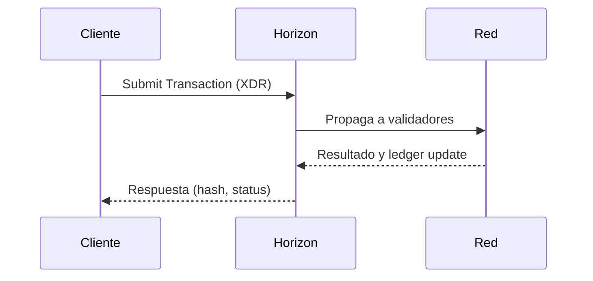
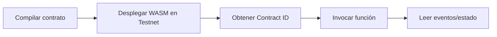
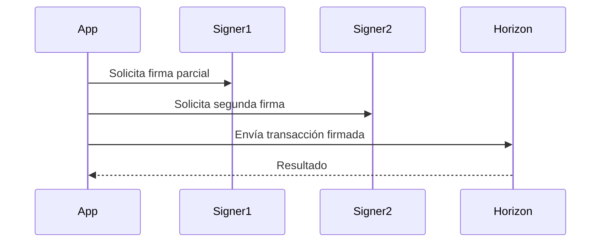

# Flujos Mermaid

## Flujo de transacción básica

```mermaid
sequenceDiagram
  participant Cliente
  participant Horizon
  participant Red
  Cliente->>Horizon: Submit Transaction (XDR)
  Horizon->>Red: Propaga a validadores
  Red-->>Horizon: Resultado y ledger update
  Horizon-->>Cliente: Respuesta (hash, status)
```

## Despliegue e invocación de contrato (Soroban)

```mermaid
flowchart LR
  A[Compilar contrato] --> B[Desplegar WASM en Testnet]
  B --> C[Obtener Contract ID]
  C --> D[Invocar función]
  D --> E[Leer eventos/estado]
```

## Multi-sig (firma múltiple)

```mermaid
sequenceDiagram
  participant App
  participant Signer1
  participant Signer2
  participant Horizon
  App->>Signer1: Solicita firma parcial
  App->>Signer2: Solicita segunda firma
  App->>Horizon: Envía transacción firmada
  Horizon-->>App: Resultado
```
