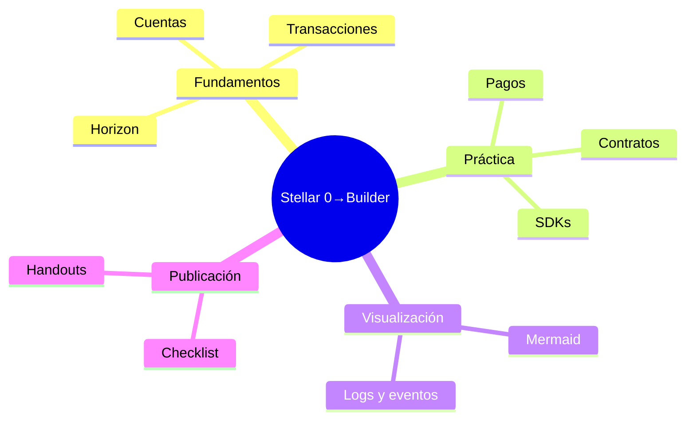

# Introducción a Stellar

Stellar es una red de pagos y emisión de activos enfocada en transferencias rápidas y de bajo costo. Sus componentes clave:
- Cuentas y claves: cada cuenta tiene clave pública y privada.
- Transacciones y operaciones: acciones atómicas (pagos, creación de cuentas, etc.).
- Horizon: API para interactuar con la red.
- Testnet: red de pruebas gratuita (con Friendbot).
- Soroban: contratos inteligentes de Stellar (basados en Rust).

## Conceptos básicos
- Activos: XLM y activos emitidos por anclas/entidades.
- Ofertas y libro de órdenes: intercambio en la propia red.
- Tarifas y límites: muy bajas, pero existen límites de recursos y almacenamiento.

## Qué aprenderás en este repo
- Enviar pagos simples y gestionar cuentas.
- Desplegar e invocar contratos Soroban en Testnet.
- Integrar clientes (JS/Python).
- Diseñar flujos y buenas prácticas de seguridad.

## Mapa visual del taller

